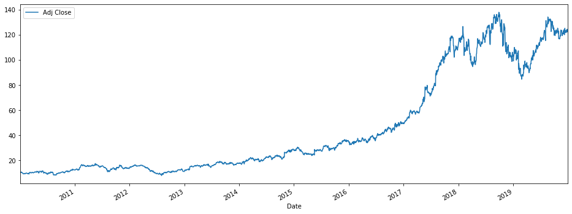
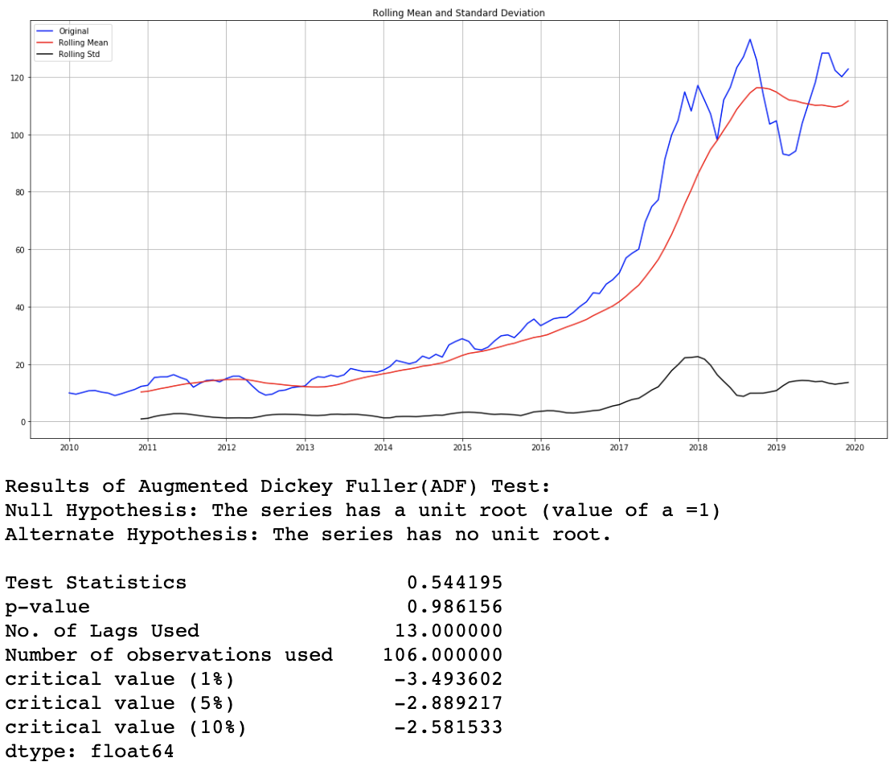
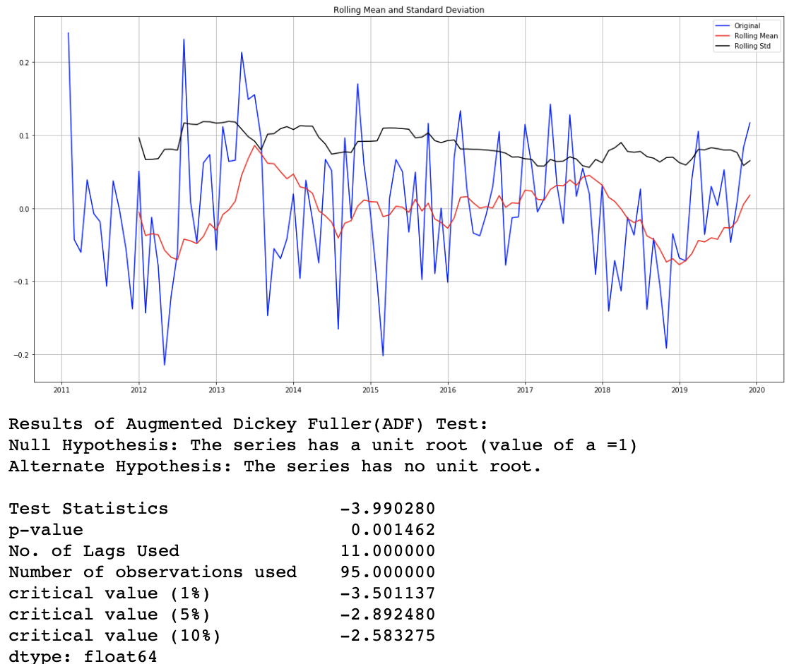
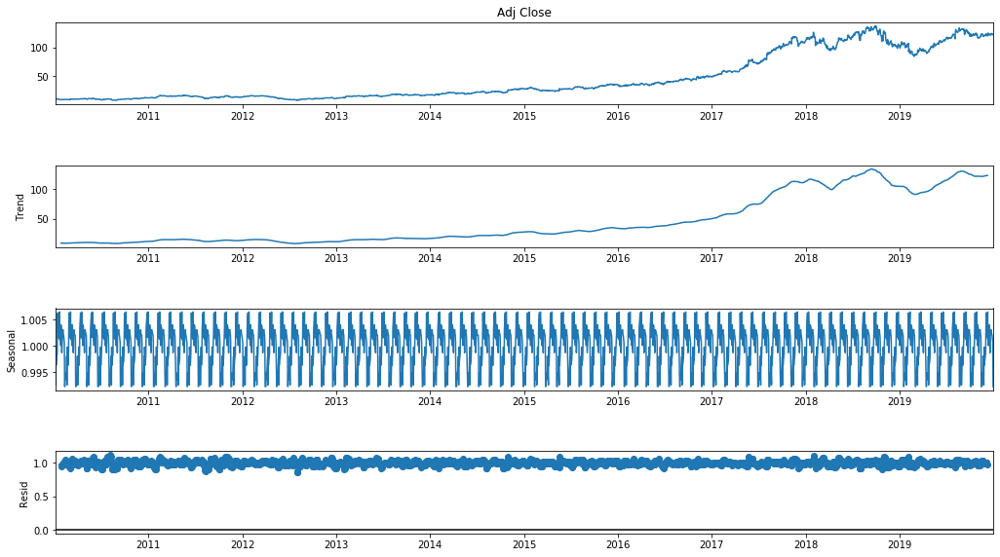

# Time Series Forecast Closing Stock Price Analysis of Take-Two Interactive Software, Inc.

June 2020

For this project I wanted to do a Time Series Forecast Analysis of Take-Two Interactive Software Inc. (TTWO), the parent company of Rockstar and 2KGames, closing stocks of for the last 10 years.

## What Did I Do?

* The Data:

  - The data was taken from https://finance.yahoo.com/, including stock data from 1/4/2010 to 6/2/2020. The Data contained a total of 2622 data points (Open, High, Low, Adjusted Close and Volume stock values per date the market was opened). I was mainly concerned with the closing stock prices, isn't everyone, so I dropped all unnecessary columns.

  - I spilt the data into training and test datasets, to later validate the accuracy of my forecasting and decrease bias. I aggregated the data by weeks, months and years (averaging the values), which also helped with some missing values.

* Exploratory Data Analysis:

  -  I made a few graphs and charts to explore and analysis the data I will be working with.

  Line Graph showing the stock prices by month and grouped by year

  Boxplot showing the range of stock prices grouped by year

  Plot of the daily closing prices for the stocks over the entire time period

* Tested for Stationarity:

  - Made a function to easily be called on a timeseries dataframe to run the Augmented Dickey Fuller (ADF) test, to check for seasonality. The test showed the data was not stationary and as is the data can not be used with ARIMA.

    As we can see above, the Test Statistics values is lower then the critical values and the p-value is much higher then the acceptable alpha value of 0.05

  -  I had to separate the seasonality and trend from the data. I did this using two different methods:

  1) Applying Transformations and using Differencing

    As we can see above, the Test Statistics values is lower then the critical values and the p-value is much higher then the acceptable alpha value of 0.05
  The best preforming actions, based on ADF test, were a Log Transformation of the first Difference with a shift of 12 months (yearly seasonality)

  2) Seasonal decomposition

  By far the easier of the two methods

* ARIMA Modeling and Error/Accuracy Computing

  - .

Hope You enjoyed my Time Series Forecast Analysis Project on Take-Two Interactive Stock Price.

Add me on LinkedIn if you liked.

## Built With

* Python 3.8
* Jupyter Notebook 6.0.0
* A few of the main imports: pandas, numpy, matplotlib/seaborn, statsmodels, pmdarima

## Authors

* **Samuel Diaz** - *Creator* - [sdman135](https://github.com/sdman135/) - [LinkedIn](https://www.linkedin.com/in/samuel-diaz-data-scientist)
